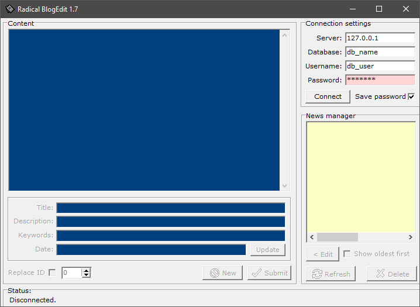

# Radical BlogEdit

### About:
A GUI tool for manage a MySQL based blog system.

### Instructions:
Create a MySQL table named "blog" with columns: "id", "title", "body", "description", "keywords" and "datetime". Run the application and enter your MySQL database details, and create, edit or delete blog entries.

### Screenshot:

### Info:
**Created:** 2006

**Operating System:** Windows 2000 or newer

**Compile with:** Borland C++ Builder 6 (NOTE: requires "[ethercode/MySQL-For-C-5.0](https://github.com/ethercode/MySQL-For-C-5.0)" files to be installed, see "readme.htm" for instructions)
